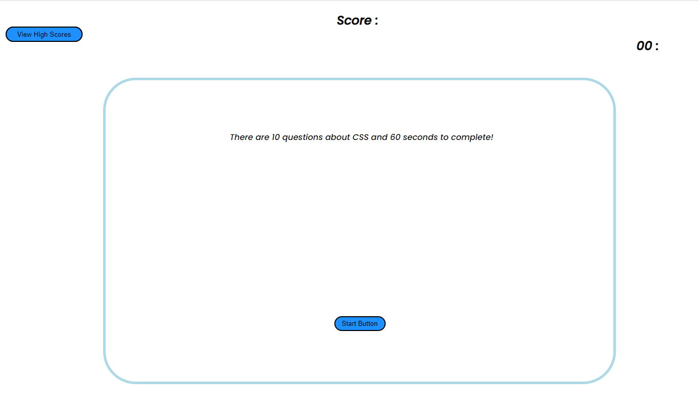

# code_quiz

## Description

This is a template for making online quizzes with high scores list, player score at the top, timer to the to right corner and a container for the quiz with buttons and basic forms without preventDefault() and instead with disabling of the "enter" key.

### Screenshots

### Deployed Website Link

https://algorithmnblues92.github.io/code_quiz/